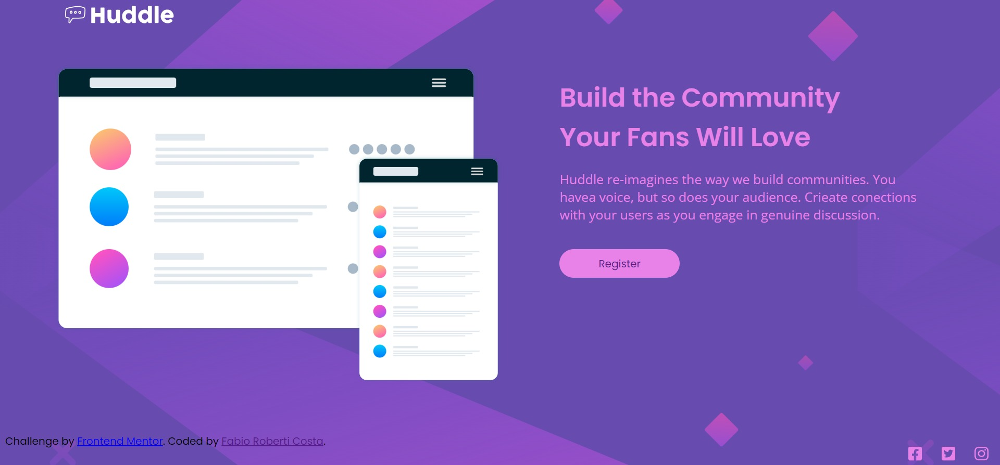

# Frontend Mentor - Huddle landing page with single introductory section solution

This is a solution to the [Huddle landing page with single introductory section challenge on Frontend Mentor](https://www.frontendmentor.io/challenges/huddle-landing-page-with-a-single-introductory-section-B_2Wvxgi0). Frontend Mentor challenges help you improve your coding skills by building realistic projects. 

## Overview

This is the result of 4 months of Fronend development studies at the DevQuest fullstack course in Brazil.

### The challenge

Build out this landing page from the designs provided in the starter code, using HTML and CSS.

The users should be able to: 

- View the optimal layout for the page depending on their device's screen size
- See hover states for all interactive elements on the page

[]

## My process

### Built with

- Semantic HTML5 markup
- CSS custom properties
- Flexbox
- @media to make the site responsive to any size of device.

### What I learned
This project really helped me improve my flexbox skills. Before it, I had a lot of doubts on positioning the elements.
It also helped me a lot when it comes to respect the parent tag during css writing.

### Continued development
This is the first of many. I will come back to it eventually, as I move along the Fullstack course.
Train more HTML and CSS before moving to JavaScript.
I am having problems dealing with the centering of the social media elements.
So HELP is very welcome!

## Author

- Frontend Mentor - @FabioRobertiCosta(https://www.frontendmentor.io/profile/FabioRobertiCosta)
- Twitter - @roberticostafab(https://www.twitter.com/@roberticostafab)

## Acknowledgments

I would really like to thank the teachers and mentors from the IT course DevQuest.
